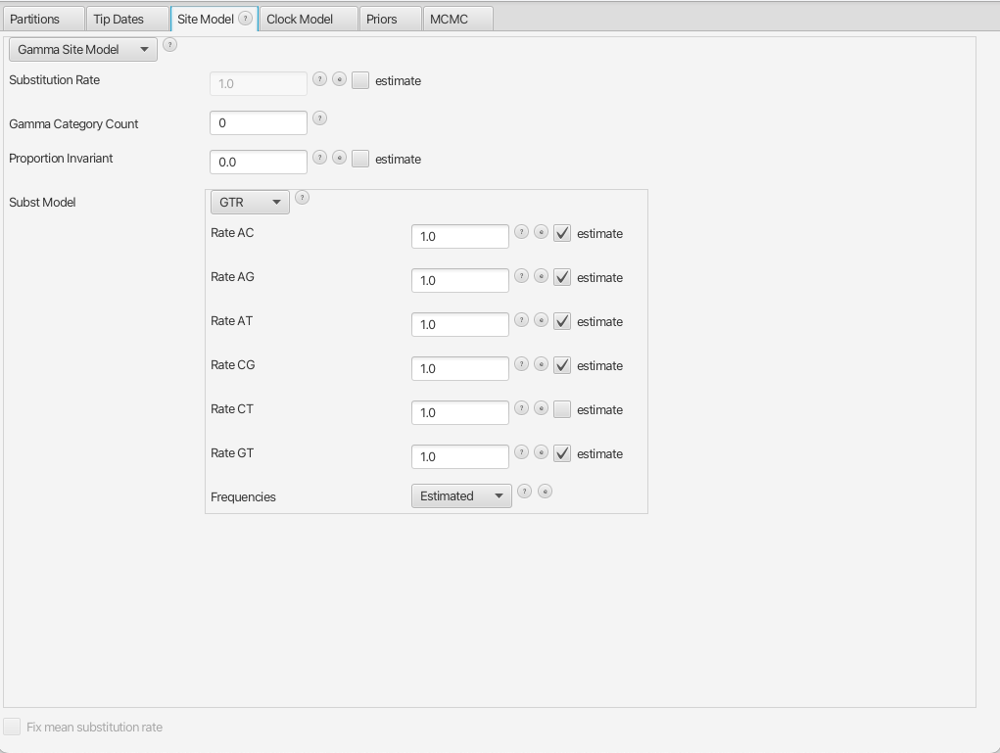
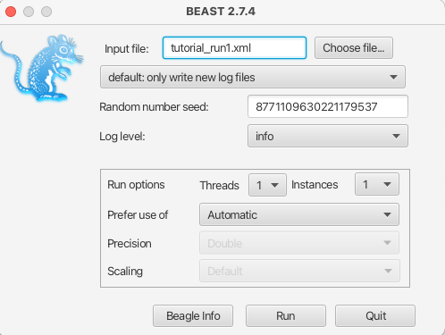
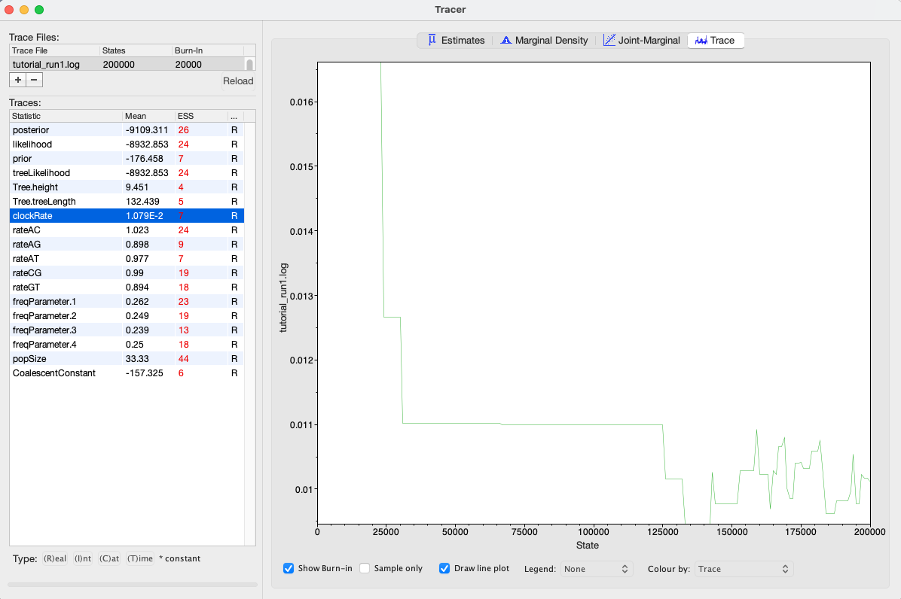
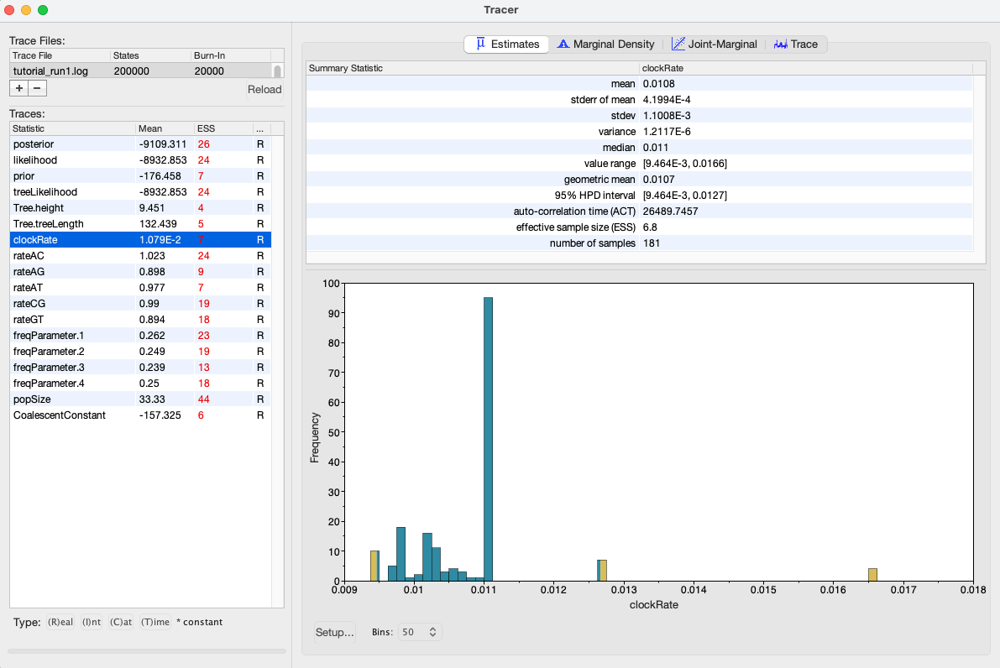
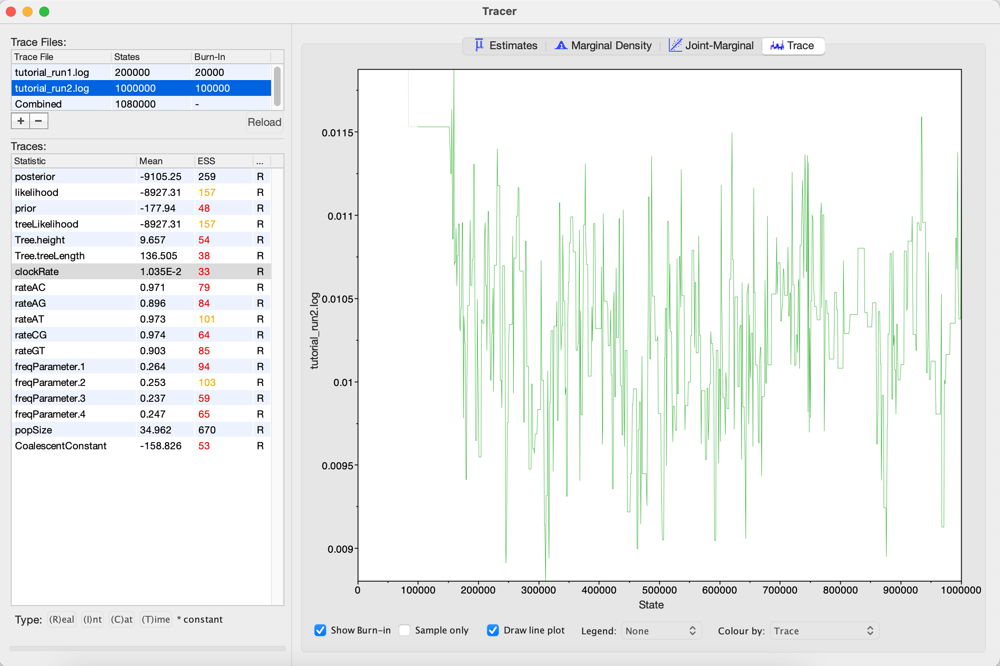
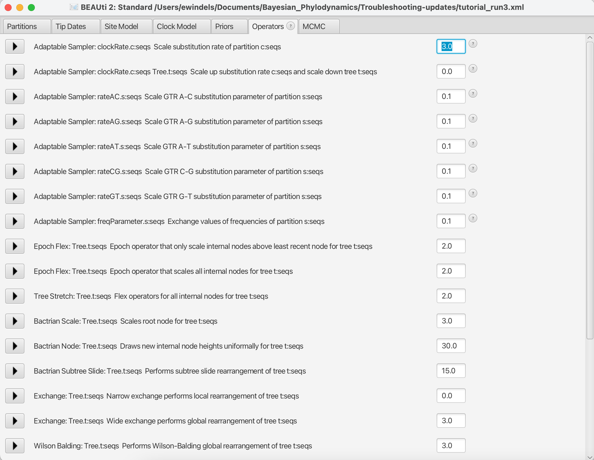
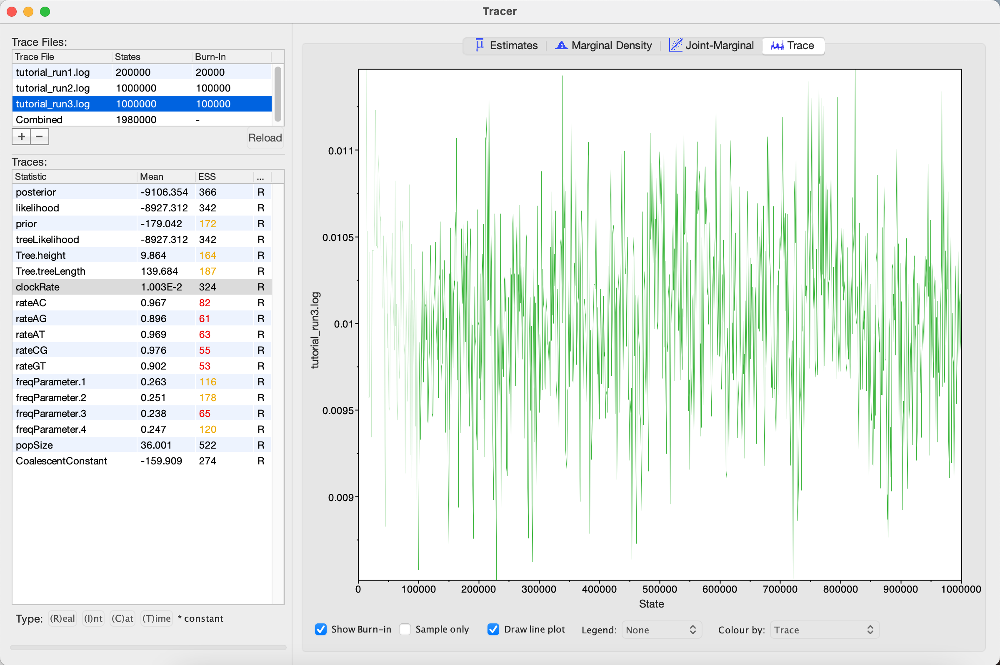
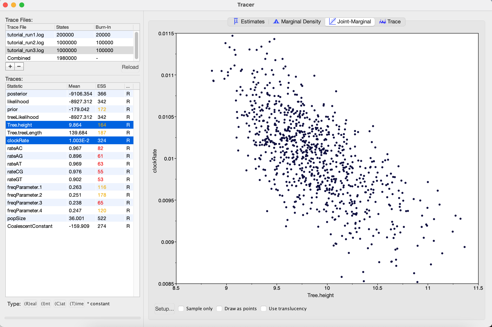
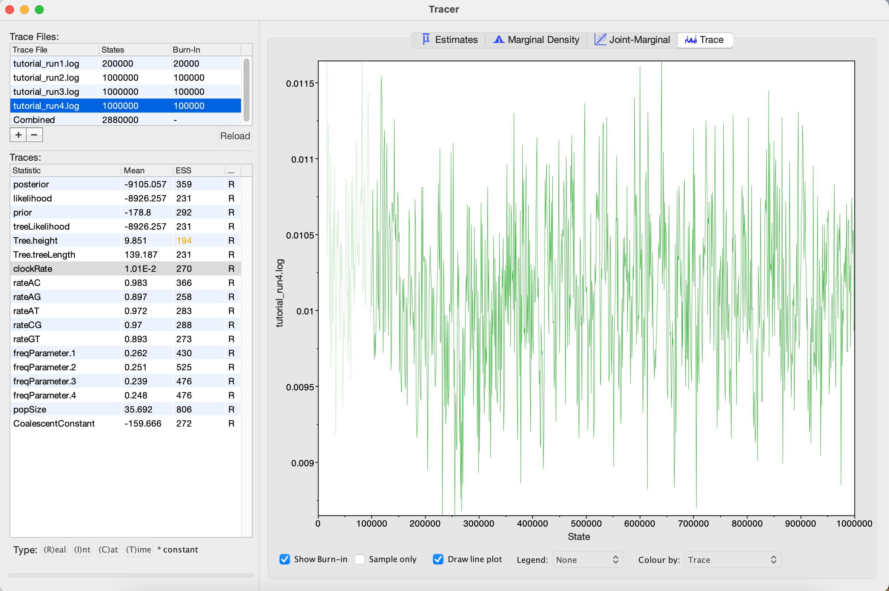

# Background

The primary goal of most phylogenetic analyses in BEAST is to infer the posterior distribution of trees and associated model parameters using Markov chain Monte Carlo (MCMC) sampling. In this tutorial, we will learn how to analyze the output of a MCMC analysis in BEAST using Tracer. This program allows us to easily visualize BEAST's output and summarize results. As we will see, we can also use Tracer to troubleshoot some of the most common MCMC problems  encountered in BEAST.

While BEAST's MCMC algorithm is fairly well optimized for phylogenetic inference, problems can arise, especially as the complexity of our data and models increase. A MCMC run may not converge on a stationary target distribution. More commonly, a run might converge but mix poorly - meaning our samples from the posterior are highly autocorrelated and therefore not independent. In these cases, it is often necessary to tune the performance of the MCMC algorithm.

In this tutorial, we will consider a relatively simple example where we would like to infer a phylogeny and evolutionary parameters from a small alignment of sequences.  Our job will be to work together to increase the efficiency of the MCMC so we can make BEAST purr...

----

# Programs used in this Exercise

### BEAST2 - Bayesian Evolutionary Analysis Sampling Trees 2

BEAST2 ([http://www.beast2.org](http://www.beast2.org)) is a free software package for Bayesian evolutionary analysis of molecular sequences using MCMC and strictly oriented toward inference using rooted, time-measured phylogenetic trees. This tutorial is written for BEAST v{{ page.beastversion }} . 

### BEAUti2 - Bayesian Evolutionary Analysis Utility

BEAUti2 is a graphical user interface tool for generating BEAST2 XML configuration files.

Both BEAST2 and BEAUti2 are Java programs, which means that the exact same code runs on all platforms. For us it simply means that the interface will be the same on all platforms. The screenshots used in this tutorial are taken on a Mac OS X computer; however, both programs will have the same layout and functionality on both Windows and Linux. BEAUti2 is provided as a part of the BEAST2 package so you do not need to install it separately.

### Tracer

Tracer ([http://tree.bio.ed.ac.uk/software/tracer](http://tree.bio.ed.ac.uk/software/tracer)) is used to summarise the posterior estimates of the various parameters sampled by the Markov Chain. This program can be used for visual inspection and to assess convergence. It helps to quickly view median estimates and 95% highest posterior density intervals of the parameters, and calculates the effective sample sizes (ESS) of parameters. It can also be used to investigate potential parameter correlations. We will be using Tracer v{{ page.tracerversion }}.

----

# Practical: Getting BEAST to purr

## The Data

To get started, I have generated a XML file that we can run our phylogenetic analysis in BEAST.

> Download the first BEAST input file `tutorial_run1.xml`
> 

The XML contains an alignment of 36 randomly simulated DNA sequences. 

## Inspecting the XML file in BEAUti

While we can open the XML file in any standard text editor, BEAUTi offers an easy way to inspect the different elements of the analysis: 

> Open BEAUti and load in the `tutorial_run1.xml` file by navigating to **File > Load**.
> 

By navigating between the different tabs at the top of the application window, we can inspect the data and each element of the analysis. For example, in the **Site Model** panel, we can see that we are fitting a GTR substitution model with no gamma rate heterogeneity ([Figure 1](#fig:beauti_run1)).

<figure>
	
	
	<figcaption>Figure 1: The Site Model panel in BEAUTi</figcaption>
</figure>
 

### Running the XML in BEAST

We are now ready to run our first analysis in BEAST.

> Open BEAST and choose `tutorial_run1.xml` as the BEAST XML file. Then click **Run**.
> 

<figure>
	
	
	<figcaption>Figure 2: Running BEAST with a user-specified random number seed.</figcaption>
</figure>
 

If you set the random number seed to 1985, you should be able to reproduce my results exactly ([Figure 2](#fig:beast_run1)). Feel free to use another seed if you would like to experiment. Since we are only running 200,000 iterations, the MCMC should finish running in under 30 seconds.

### Visualizing BEAST's output in Tracer

> Open Tracer and navigate to **File > Import Trace File**, then open `tutorial_run1.log`
> 

Tracer allows us to quickly visualize BEAST's MCMC output in order to check performance and see our parameter estimates. On the left there is a panel where all model parameters are listed along with their mean posterior estimates and Effective Sample Size (ESS). Recall that the ESS tells us how many pseudo-independent samples we have from the posterior, so the higher the better. Here, we can see that the ESS is low for all parameters, indicating that we do not yet have a good estimate of the posterior distribution.

By selecting a parameter in the left panel and then clicking on the **Trace** tab, we can see how the MCMC explored parameter space ([Figure 3](#fig:tracer_run1)). For the clockRate parameter for instance, we see that the chain quickly converged to a value of about 0.01 (the true value used to simulate the sequence data), but mixing was poor, hence the low ESS. 

<figure>
	
	
	<figcaption>Figure 3: A trace plot for the clockRate parameter</figcaption>
</figure>
 

We can also be see our posterior estimates for each parameter by clicking on the **Estimates** tab while highlighting the desired parameter in the left panel. This provides us with various summary statistics and a frequency histogram representing our estimate of the posterior distribution constructed from our MCMC samples. For the clockRate parameter, we can see that our estimate of the posterior is extremely rough, again because we have so few uncorrelated samples from the posterior ([Figure 4](#fig:tracer_run1_ests)).

<figure>
	
	
	<figcaption>Figure 4: Posterior estimates of the clockRate in Tracer.</figcaption>
</figure>
 

### Run 2: Increasing the chain length

By checking the ESS, trace plots and parameter estimates, we got the picture that none of our parameters in Run 1 mixed well. In this case, the simplest thing to try is to rerun the MCMC for more iterations.

> Load the `tutorial_run1.xml` back into BEAUti using **File > Load**. Navigate to the MCMC panel and increase the chain length to 1 million . You may also want to change the file name for the log file to `tutorial_run2.log` so we do not overwrite our previous results. When done, navigate **File > Save As** and save as `tutorial_run2.xml`.
> 

> Run the `tutorial_run2.xml` file in BEAST as we did before. When done, open the `tutorial_run2.log` in Tracer.
> 

<figure>
	
	
	<figcaption>Figure 5: Increasing the chain length in BEAUTi</figcaption>
</figure>
 

Looking at the MCMC output in Tracer, we see that that increasing the chain length did help some ([Figure 6](#fig:tracer_run2)). The ESS values are higher and the traces look better, but still not great. In the next section, we will continue to focus on the clockRate parameter because it still has a low ESS and appears to mix especially poorly. 

<figure>
	
	
	<figcaption>Figure 6: A trace plot for the clockRate parameter</figcaption>
</figure>
 

### Run 3: Changing the clockRate operators

If one parameter in particular is not converging or mixing well, we can try to tweak that parameter's operator(s). Remember that BEAST's operators control what new parameter values are proposed at each MCMC iteration and how these proposals are made (i.e. the proposal distribution). Since the **clockRate** parameter was not mixing well in Run 2, we will try increasing the frequency at which new **clockRates** are proposed.

> Load the `tutorial_run2.xml` back into BEAUti and select `View > Show Operators` panel. This will bring up a new panel showing all the operators in use ([Figure 7](#fig:beauti_run3)). Click on the black triangle next to `Scale:clockRate`. In the menu that drops down, check **Optimize**. In the box to the right of `Scale.clockRate`, change the value from **0.1** to **3.0**. Now navigate to the MCMC panel and change the file name for the log file to `tutorial_run3.log`. When done, save as `tutorial_run3.xml`.
> 

<figure>
	
	
	<figcaption>Figure 7: The Operators panel in BEAUTi</figcaption>
</figure>
 
 

So, what just happened? We told BEAST to try to automatically optimize the scale operator on the clockRate, which moves the parameter value up or down. Note that by default, operators are automatically optimized in BEAST, but for the purposes of this tutorial I turned off auto-optimization to get especially bad mixing. We also increased the weight on this scale operator so that new **clockRates** will be proposed more often in the MCMC. Going from a weight of 0.1 to 3.0 means that new proposals for that parameter will be made thirty times as often, but the frequency at which a given operator is called depends on the weights given to other operators. So if there are parameters with very high ESS values, we may want to reallocate weight on their operators to operators on less well mixing parameters. For fun, you may want to guess what each operator in the **Operators** panel is doing.

> Run the `tutorial_run3.xml` in BEAST and then open the `tutorial_run3.log` in Tracer.
> 

We can see that optimizing the operator dramatically improves mixing for the clockRate ([Figure 8](#fig:tracer_run3)). But there is still room for improvement.

<figure>
	
	
	<figcaption>Figure 8: A trace plot for the clockRate parameter</figcaption>
</figure>
 
 

One thing to keep in mind is that BEAST is using MCMC to explore a multidimensional parameter space, and poor mixing in one dimension can be caused by poor mixing in another dimension. This often arises because two parameters are highly correlated. We can identify these correlations in Tracer by visualizing the joint distribution of a pair of parameters together. To do this, select one parameter in the left panel and then, while holding the command key (Mac) or control key (Windows), select another. Then click on the **Joint-Marginal** tab at the top. Looking at the pairwise joint distribution for **TreeHeight** and **clockRate**, we see that these two parameters are highly negatively correlated ([Figure 9](#fig:tracer_run3Joint)). We therefore may want to add an operator that updates these parameters together to more efficiently explore their parameter space.

<figure>
	
	
	<figcaption>Figure 9: The joint posterior distribution of TreeHeight and clockRate</figcaption>
</figure>
 

### Run 4: Adding an upDown operator

The easiest way to improve MCMC performance when two parameters are highly negatively correlated is to add an **UpDown** operator. This operator scales one parameter up while scaling the other parameter down. If two parameters are highly positively correlated we can also use this operator to scale both parameters in the same direction, up or down. 

> Load the `tutorial_run3.xml` back into BEAUti and select `View > Show Operators` panel. Click on the black triangle next to **UpDown clockRate**. In the menu that drops down, check **Optimize**. In the box to the right, change the weight on the UpDown operator from **0.0** to **3.0**. In the MCMC panel, change the file name for the log file to `tutorial_run4.log`. When done, save as tutorial_run4.xml`.
> 

We just added an **UpDown** operator on the **clockRate** and the **TreeHeight**. The fact that these two parameters are highly negatively correlated makes perfect sense. An increase in the **clockRate** means that less time is needed for substitutions to accumulate along branches; meaning branches can be shorter and yet still explain the same amount of accumulated evolutionary change in the sequence data. If all branches in the tree become shorter, then the total **TreeHeight** will also decrease. Thus it makes sense to include an **UpDown** operator on **clockRate** and **TreeHeight**. In fact, by default BEAUTi includes this operator. However, I disabled it in the original XML file by setting the weight on this operator to zero for the purpose of illustration.

> Run the `tutorial_run4.xml` in BEAST and then open the `tutorial_run4.log` in Tracer.
> 

Looking at the MCMC output in Tracer, we see that all parameters are starting to mix well with relatively high ESS values. Personally, I would probably want to run one final MCMC for several million iterations just to be on the safe side, but this can easily be done by adding more iterations to the chain as we did for Run 2.  Alternatively, multiple different MCMC runs can be combined using the program LogCombiner that comes packaged with BEAST. This may be better than running one single long analysis, as it allows us to be sure independent runs are converging on similar parameters.  

<figure>
	
	
	<figcaption>Figure 10: A trace plot for the clockRate parameter</figcaption>
</figure>
 

### Further things to keep in mind

-  The number of MCMC iterations needed to achieve a reasonable posterior sample in this tutorial was quite small. With larger alignments, much longer chains may be needed.
-  In this tutorial we only considered MCMC performance with respect to exploring parameter space, but we also need to consider tree space. One simple diagnostic for checking convergence and mixing in tree space is to look at the trace plot for the tree likelihood. Poor mixing in the tree likelihood can indicate problems exploring tree space.
-  It is always a good idea to check your posterior estimates against sampling from the prior.  

# Useful Links

-  [*Bayesian Evolutionary Analysis with BEAST 2; chapter 10.*](http://www.beast2.org/book.html)  

----

# Relevant References



