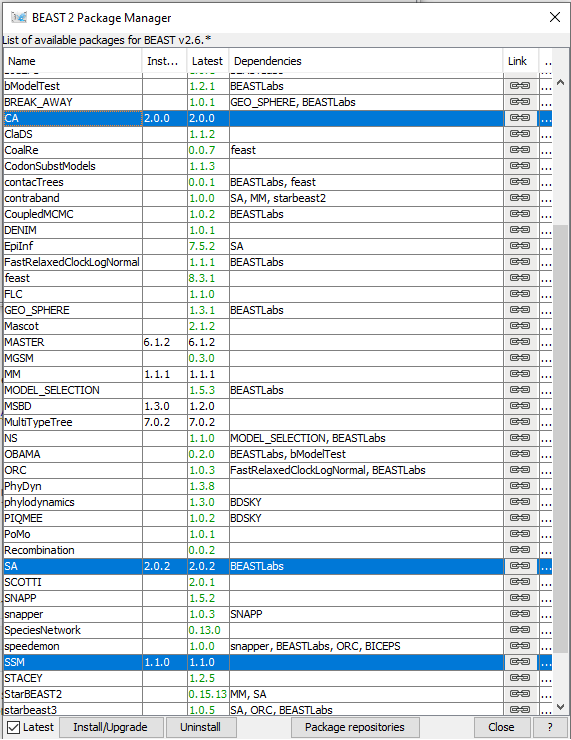
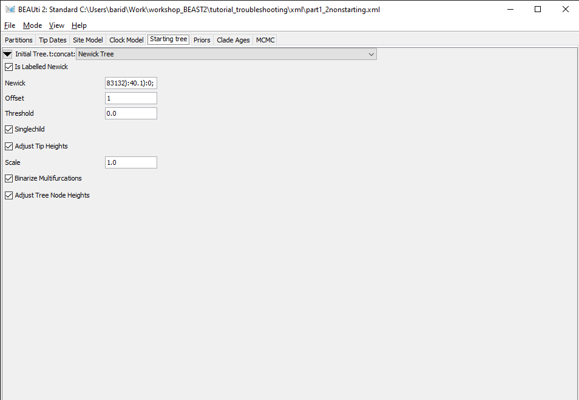
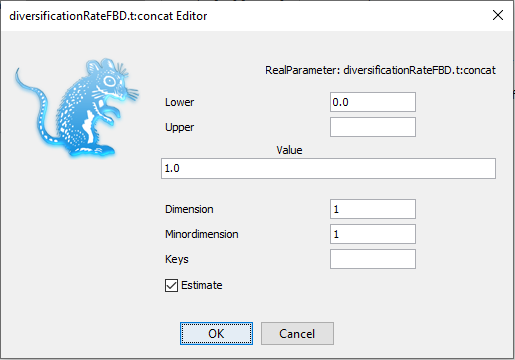

# Background

The primary goal of most phylogenetic analyses in BEAST is to infer the posterior distribution of trees and associated model parameters using Markov chain Monte Carlo (MCMC) sampling. In this tutorial, we will learn how to analyze the output of a MCMC analysis in BEAST using Tracer. This program allows us to easily visualize BEAST's output and summarize results. As we will see, we can also use Tracer to troubleshoot some of the most common MCMC problems  encountered in BEAST.

While BEAST's MCMC algorithm is fairly well optimised for phylogenetic inference, problems can arise, especially as the complexity of our data and models increase. A MCMC run may not converge on a stationary target distribution. More commonly, a run might converge but mix poorly - meaning our samples from the posterior are highly autocorrelated and therefore not independent. In these cases, it is often necessary to tune the performance of the MCMC algorithm.


----

# Programs used in this Exercise

### BEAST2 - Bayesian Evolutionary Analysis Sampling Trees 2

BEAST2 ([http://www.beast2.org](http://www.beast2.org)) is a free software package for Bayesian evolutionary analysis of molecular sequences using MCMC and strictly oriented toward inference using rooted, time-measured phylogenetic trees. This tutorial is written for BEAST v{{ page.beastversion }} . 


### BEAUti2 - Bayesian Evolutionary Analysis Utility

BEAUti2 is a graphical user interface tool for generating BEAST2 XML configuration files.

Both BEAST2 and BEAUti2 are Java programs, which means that the exact same code runs on all platforms. For us it simply means that the interface will be the same on all platforms. The screenshots used in this tutorial are taken on a Mac OS X computer; however, both programs will have the same layout and functionality on both Windows and Linux. BEAUti2 is provided as a part of the BEAST2 package so you do not need to install it separately.


### Tracer

Tracer ([http://tree.bio.ed.ac.uk/software/tracer](http://tree.bio.ed.ac.uk/software/tracer)) is used to summarise the posterior estimates of the various parameters sampled by the Markov Chain. This program can be used for visual inspection and to assess convergence. It helps to quickly view median estimates and 95% highest posterior density intervals of the parameters, and calculates the effective sample sizes (ESS) of parameters. It can also be used to investigate potential parameter correlations. We will be using Tracer v{{ page.tracerversion }}.


----

# Practical: Troubleshooting starting issues

In this part of the tutorial, we will see several issues which can prevent a BEAST2 inference from even starting, and demonstrate how to fix them.

## The Data

All examples in this section are inspired by real issues encountered during the analysis of the convergent evolution of true crabs . The dataset used is composed of sequences for 344 extant species of the infraorder Brachyura, in addition to fossil calibrations or fossil samples for this clade. Note that the runs presented here have been simplified from the original, in particular many of the alignment partitions used in the original analysis have been removed.

## Packages

The following packages are required to run the examples: SA, CA, SSM.

> Launch **BEAUti**, then open the **BEAST2 Package Manager** by navigating to **File > Manage Packages**. ([Figure 1](#packageManage1))
> 

<figure>
	<a id="packageManage1"></a>
	
	<figcaption>Figure 1: Finding the BEAST2 Package Manager.</figcaption>
</figure>
<br>


> Install the **CA**, **SA** and **SSM** packages by selecting them and clicking the **Install/Upgrade** button. ([Figure 2](#packageManage2))
> 

<figure>
	<a id="packageManage2"></a>
	
	<figcaption>Figure 2: The BEAST2 Package Manager.</figcaption>
</figure>
<br>


BEAUti needs to be closed for the newly installed packages to be loaded properly.

> Close the **BEAST2 Package Manager** and **BEAUti**.
> 

## XML parsing issue

> Download the BEAST input file `part1_xmlparsing.xml` and `part1_1xmlparsing_working.xml`.
> Open **BEAST2** and select the file `part1_xmlparsing.xml` as input file. Start the run with the **Run** button.
> You should get an error message, as shown in [Figure 3](#errorParsing).
>

<figure>
	<a id="errorParsing"></a>
	
	<figcaption>Figure 3: Error message in BEAST2.</figcaption>
</figure>
<br>

Here the run failed to start because the XML configuration file could not be parsed, as explained by the error message _Error 110 parsing the xml input file_. Thankfully the error message tells us exactly where the error happened (_<log id='rate.c:12S' spec='beast.evolution.branchratemodel.RateStatistic'>_) and what is the issue (_Input 'tree' must be specified._). If we open the `part1_xmlparsing.xml` file and look for **rate.c:12S**, we can see that line 1297 corresponds to the error message and reads as follows:
```xml
	<log id="rate.c:12S" spec="beast.evolution.branchratemodel.RateStatistic" branchratemodel="@RelaxedClock.c:12S"/>
```
By comparing to a previous (working) analysis in the file `part1_1xmlparsing_working.xml`, we can see that the correct configuration should be (line 497):
```xml
	<log id="rate.c:12S" spec="beast.evolution.branchratemodel.RateStatistic" branchratemodel="@RelaxedClock.c:12S" tree="@Tree.t:concat"/>
```
As the error message told us, the **tree** element of the configuration is missing in the non-working XML file. Putting it back allows us to start the run.

> Open the file `part1_xmlparsing.xml` in a text editor.
> Modify **line 1297** of the file to add the **tree="@Tree.t:concat"** element. Save the file as `part1_xmlparsing_fixed.xml`.
> Open **BEAST2** and select the file `part1_xmlparsing_fixed.xml` as input file. Start the run with the **Run** button.
> Now it works!
>

XML parsing errors usually occur when the XML file has been manually edited and parts of the configuration have been accidentally deleted or modified. This is why it's important to always keep a copy of the original XML when making manual edits, as this provides an easy way to check the correct configuration. If an XML parsing error occurs in a file which was generated entirely through BEAUti, then this is likely a BEAUti bug and should be reported to the development team.

## Issue with finding an initial state

> Download the BEAST input file `part1_2nonstarting.xml`.
> Open **BEAST2** and select the file `part1_2nonstarting.xml` as input file. Start the run with the **Run** button.
> You should get an error message, as shown in [Figure 4](#errorStarting).
> 

<figure>
	<a id="errorStarting"></a>
	
	<figcaption>Figure 4: Another error message in BEAST2.</figcaption>
</figure>
<br>

In this situation, the inference failed to start because a good initial state could not be found, as explained by the error message (_Fatal exception: Could not find a proper state to initialise._). This issue is much more complex to diagnose than the previous one, as it can be caused by many different parts of the analysis configuration. However, as above the error message provides some information on the source of the problem, as it details the probability of all the components of the analysis. The message reads _P(FBD.t:concat) = -Infinity_, showing that the issue likely appears in the calculation of the FBD likelihood. The FBD prior is a tree prior, and depends on the tree as well as several other parameters, so there are several possible causes for the calculation issue:
- a bug in the likelihood calculation itself: BEAST2 packages can contain calculation issues which have been undetected so far (especially if they only appear in very specific circumstances), in which case they should be reported to the development team. However, this is unlikely in our case, as the FBD model has been extensively used without issue in previous analyses, and our analysis setup is similar to previous analyses.
- an issue with the initial tree: the inference will not start if the provided initial tree is impossible under the specified tree model or doesn't match with the provided MRCA constraints. By default, most analyses use a random tree simulated by the inference, which will fulfill all constraints. However, with more complex models or constraints, the simulation process can fail to find a good tree, in which case a valid starting tree needs to be provided by the user.
- an issue with the initial values of the parameters: if the initial values set in the analysis are very far from plausible, the resulting likelihood of the model will be extremely small, which gets recorded as _-Infinity_ by BEAST2.

To inspect the starting values and find the issue, we will first load the file into BEAUti.

> Open BEAUti and load in the `part1_2nonstarting.xml` file by navigating to **File > Load**.
> 

The starting tree can be found in the **Starting tree** panel, which is hidden by default.

> Open the **Starting tree** panel by navigating to **View > Show Starting tree panel**.
> Switch to the **Starting tree** panel.
>

<figure>
	<a id="startingTree"></a>
	
	<figcaption>Figure 5: Starting tree panel.</figcaption>
</figure>
<br>

As we can see in [Figure 5](#startingTree), the initial tree in this analysis is set to a Newick tree, chosen by the user. The **Newick** box gives the full Newick string, which we could use to inspect the tree in an other program. This string can also be copied directly from the XML file. First, we will check if this tree is compatible with the tree constraints set in the **Priors** panel.

> Switch to the **Priors** panel.
> Click on the arrow left of the **Root.prior** to see the details of this prior ([Figure 6](#rootPrior)).
>

<figure>
	<a id="rootPrior"></a>
	
	<figcaption>Figure 6: Priors panel showing the root prior.</figcaption>
</figure>
<br>

The only constraint set on the tree is a prior on the age of the root, which we can see in the **Priors** panel. By checking the details, we can see that this is a wide lognormal prior, with the 5% quantile of the prior at 206 Ma and the 95% quantile at 437 Ma. Let's import our starting tree in Icytree to check if the root age is compatible with the prior.

> Open Icytree ([https://icytree.org/](https://icytree.org/)) in a web browser.
> Copy the Newick string from the **Starting tree** panel or from the XML file.
> Paste the string into a blank text file and save it as `starting.tre`.
> Drag and drop the `starting.tre` file into Icytree.
>

By hovering over the root node of the starting tree, we can see that its age is set to **305.91 Ma**, which is consistent with the root prior set in the analysis. 

Next, we will inspect the starting values of the parameters of the FBD model, found in the **Priors** panel in **BEAUti**. The FBD model has 3 parameters: the diversification rate, the turnover and the sampling proportion. For each parameter, the starting value is shown in the box to the right, as **initial = [x] [min, max]** ([Figure 7](#initialVal)). Here _x_ indicates the starting value and _min_ and _max_ the range of possible values for the corresponding parameter.
Thus we can see that the initial diversification rate is **1.0**, the initial sampling proportion is **0.5** and the initial turnover is **0.5**. These are the default values for these parameters, but they may not be adapted to all datasets. In particular, a diversification rate of 1.0/My is a very high value - since our starting tree is 300 My old, it means that we would expect about **exp(300 x 1.0) = 2 x 10^130** extant species. Having a very implausible starting value for the diversification rate could explain the failure we observed earlier when calculating the likelihood of the FBD model, so we will change it to a more realistic value of **0.01**.

<figure>
	<a id="initialVal"></a>
	
	<figcaption>Figure 7: Initial values in the Priors panel.</figcaption>
</figure>
<br>

> In the **Priors** panel, click on the **initial = [1.0]** box right of the **diversificationRateFBD** parameter.
> Change the initial value in the **Value** box to **0.01** ([Figure 8](#initialDiv)).
> Click on **OK** to close the box.
> Save the updated configuration as `part1_2nonstarting_fixed.xml` by navigating to **File > Save As**.
> Open **BEAST2** and select `part1_2nonstarting_fixed.xml` as the input file.
> Start the run with the **Run** button. It works now!
>

<figure>
	<a id="initialDiv"></a>
	
	<figcaption>Figure 8: Changing the initial value.</figcaption>
</figure>
<br>

# Practical: Convergence issues

In this part of the tutorial, we will consider a relatively simple example where we would like to infer a phylogeny and evolutionary parameters from a small alignment of sequences.  Our job will be to work together to increase the efficiency of the MCMC so we can get the analysis to converge...

## The Data

To get started, I have generated a XML file that we can run our phylogenetic analysis in BEAST.


> Download the first BEAST input file `part2_tutorial_run1.xml`
> 

The XML contains an alignment of 36 randomly simulated DNA sequences. 


## Inspecting the XML file in BEAUti

While we can open the XML file in any standard text editor, BEAUTi offers an easy way to inspect the different elements of the analysis: 


> Open BEAUti and load in the `part2_tutorial_run1.xml` file by navigating to **File > Load**.
> 

By navigating between the different tabs at the top of the application window, we can inspect the data and each element of the analysis. For example, in the **Site Model** panel, we can see that we are fitting a GTR substitution model with no gamma rate heterogeneity ([Figure 9](#fig:beauti_run1)).

<figure>
	<a id="fig:beauti_run1"></a>
	
	<figcaption>Figure 9: The Site Model panel in BEAUTi</figcaption>
</figure>
<br>


### Running the XML in BEAST

We are now ready to run our first analysis in BEAST.


> Open BEAST and choose `part2_tutorial_run1.xml` as the BEAST XML file. Then click **Run**.
> 

<figure>
	<a id="fig:beast_run1"></a>
	
	<figcaption>Figure 10: Running BEAST with the specified XML configuration file.</figcaption>
</figure>
<br>

Since we are only running 200,000 iterations, the MCMC should finish running in under 30 seconds.


### Visualizing BEAST's output in Tracer


> Open Tracer and navigate to **File > Import Trace File**, then open `part2_tutorial_run1.log`
> 

The results of your run will look similar, but not necessarily identical, to my results shown in [Figure 10](#fig:beast_run1).

Tracer allows us to quickly visualize BEAST's MCMC output in order to check performance and see our parameter estimates. On the left there is a panel where all model parameters are listed along with their mean posterior estimates and Effective Sample Size (ESS). Recall that the ESS tells us how many pseudo-independent samples we have from the posterior, so the higher the better. Here, we can see that the ESS is low for all parameters, indicating that we do not yet have a good estimate of the posterior distribution.

By selecting a parameter in the left panel and then clicking on the **Trace** tab, we can see how the MCMC explored parameter space ([Figure 11](#fig:tracer_run1)). For the **clockRate** parameter for instance, we see that the chain quickly converged to a value of about 0.01 (the true value used to simulate the sequence data), but mixing was poor, hence the low ESS. 

<figure>
	<a id="fig:tracer_run1"></a>
	
	<figcaption>Figure 11: A trace plot for the **clockRate** parameter</figcaption>
</figure>
<br>


We can also see our posterior estimates for each parameter by clicking on the **Estimates** tab while highlighting the desired parameter in the left panel. This provides us with various summary statistics and a frequency histogram representing our estimate of the posterior distribution constructed from our MCMC samples. For the **clockRate** parameter, we can see that our estimate of the posterior is extremely rough, again because we have so few uncorrelated samples from the posterior ([Figure 12](#fig:tracer_run1_ests)).

<figure>
	<a id="fig:tracer_run1_ests"></a>
	
	<figcaption>Figure 12: Posterior estimates of the **clockRate** in Tracer.</figcaption>
</figure>
<br>


### Run 2: Increasing the chain length

By checking the ESS, trace plots and parameter estimates, we got the picture that none of our parameters in Run 1 mixed well. In this case, the simplest thing to try is to rerun the MCMC for more iterations.


> Load the `part2_tutorial_run1.xml` back into BEAUti using **File > Load**. Navigate to the MCMC panel and increase the chain length to 1 million. You may also want to change the file name for the log file to `part2_tutorial_run2.log` and to `part2_tutorial_run2.trees` for the tree file so we do not overwrite our previous results. When done, navigate **File > Save As** and save as `part2_tutorial_run2.xml`.
> 


> Run the `part2_tutorial_run2.xml` file in BEAST as we did before. When done, open the `part2_tutorial_run2.log` in Tracer.
> 

<figure>
	<a id="fig:beauti_run2"></a>
	
	<figcaption>Figure 13: Increasing the chain length in BEAUTi</figcaption>
</figure>
<br>


Looking at the MCMC output in Tracer, we see that that increasing the chain length did help some ([Figure 14](#fig:tracer_run2)). The ESS values are higher and the traces look better, but still not great. In the next section, we will continue to focus on the **clockRate** parameter because it still has a low ESS and appears to mix especially poorly. 

<figure>
	<a id="fig:tracer_run2"></a>
	
	<figcaption>Figure 14: A trace plot for the **clockRate** parameter</figcaption>
</figure>
<br>


### Run 3: Changing the **clockRate** operators

If one parameter in particular is not converging or mixing well, we can try to tweak that parameter's operator(s). Remember that BEAST's operators control what new parameter values are proposed at each MCMC iteration and how these proposals are made (i.e. the proposal distribution). Since the **clockRate** parameter was not mixing well in Run 2, we will try increasing the frequency at which new **clockRates** are proposed.


> Load the `part2_tutorial_run2.xml` back into BEAUti and select `View > Show Operators` panel. This will bring up a new panel showing all the operators in use ([Figure 15](#fig:beauti_run3)). Click on the black triangle next to `Scale:clockRate`. In the menu that drops down, check **Optimise**. In the box to the right of `Scale.clockRate`, change the value from **0.1** to **3.0**. Now navigate to the MCMC panel and change the file name for the log file to `part2_tutorial_run3.log` and the tree file to `part2_tutorial_run3.trees`. When done, save as `part2_tutorial_run3.xml`.
> 

<figure>
	<a id="fig:beauti_run3"></a>
	
	<figcaption>Figure 15: The Operators panel in BEAUTi</figcaption>
</figure>
<br>
 

So, what just happened? We told BEAST to try to automatically optimise the scale operator on the **clockRate**, which moves the parameter value up or down. Note that by default, operators are automatically optimised in BEAST, but for the purposes of this tutorial I turned off auto-optimization to get especially bad mixing. We also increased the weight on this scale operator so that new **clockRates** will be proposed more often in the MCMC. Going from a weight of 0.1 to 3.0 means that new proposals for that parameter will be made thirty times as often, but the frequency at which a given operator is called depends on the weights given to other operators. So if there are parameters with very high ESS values, we may want to reallocate weight on their operators to operators on less well mixing parameters. For fun, you may want to guess what each operator in the **Operators** panel is doing.


> Run the `part2_tutorial_run3.xml` in BEAST and then open the `part2_tutorial_run3.log` in Tracer.
> 

We can see that optimizing the operator dramatically improves mixing for the **clockRate** ([Figure 16](#fig:tracer_run3)). But there is still room for improvement.

<figure>
	<a id="fig:tracer_run3"></a>
	
	<figcaption>Figure 16: A trace plot for the **clockRate** parameter</figcaption>
</figure>
<br>
 

One thing to keep in mind is that BEAST is using MCMC to explore a multidimensional parameter space, and poor mixing in one dimension can be caused by poor mixing in another dimension. This often arises because two parameters are highly correlated. We can identify these correlations in Tracer by visualizing the joint distribution of a pair of parameters together. To do this, select one parameter in the left panel and then, while holding the command key (Mac) or control key (Windows), select another. Then click on the **Joint-Marginal** tab at the top. Looking at the pairwise joint distribution for **TreeHeight** and **clockRate**, we see that these two parameters are highly negatively correlated ([Figure 17](#fig:tracer_run3Joint)). We therefore may want to add an operator that updates these parameters together to more efficiently explore their parameter space.

<figure>
	<a id="fig:tracer_run3Joint"></a>
	
	<figcaption>Figure 17: The joint posterior distribution of **TreeHeight** and **clockRate**</figcaption>
</figure>
<br>


### Run 4: Adding an upDown operator

The easiest way to improve MCMC performance when two parameters are highly negatively correlated is to add an **UpDown** operator. This operator scales one parameter up while scaling the other parameter down. If two parameters are highly positively correlated we can also use this operator to scale both parameters in the same direction, up or down. 


> Load the `part2_tutorial_run3.xml` back into BEAUti and select `View > Show Operators` panel. Click on the black triangle next to **UpDown clockRate**. In the menu that drops down, check **Optimise**. In the box to the right, change the weight on the UpDown operator from **0.0** to **3.0**. In the MCMC panel, change the file name for the log file to `part2_tutorial_run4.log` and the tree file to `part2_tutorial_run4.trees`. When done, save as part2_tutorial_run4.xml`.
> 

We just added an **UpDown** operator on the **clockRate** and the **TreeHeight**. The fact that these two parameters are highly negatively correlated makes perfect sense. An increase in the **clockRate** means that less time is needed for substitutions to accumulate along branches; meaning branches can be shorter and yet still explain the same amount of accumulated evolutionary change in the sequence data. If all branches in the tree become shorter, then the total **TreeHeight** will also decrease. Thus it makes sense to include an **UpDown** operator on **clockRate** and **TreeHeight**. In fact, by default BEAUTi includes this operator. However, I disabled it in the original XML file by setting the weight on this operator to zero for the purpose of illustration.


> Run the `part2_tutorial_run4.xml` in BEAST and then open the `part2_tutorial_run4.log` in Tracer.
> 

Looking at the MCMC output in Tracer, we see that all parameters are starting to mix well with relatively high ESS values. Personally, I would probably want to run one final MCMC for several million iterations just to be on the safe side, but this can easily be done by adding more iterations to the chain as we did for Run 2.  Alternatively, multiple different MCMC runs can be combined using the program LogCombiner that comes packaged with BEAST. This may be better than running one single long analysis, as it allows us to be sure independent runs are converging on similar parameters.  

<figure>
	<a id="fig:tracer_run4"></a>
	
	<figcaption>Figure 18: A trace plot for the **clockRate** parameter</figcaption>
</figure>
<br>


### Further things to keep in mind


-  The number of MCMC iterations needed to achieve a reasonable posterior sample in this tutorial was quite small. With larger alignments, much longer chains may be needed.
-  In this tutorial we only considered MCMC performance with respect to exploring parameter space, but we also need to consider tree space. One simple diagnostic for checking convergence and mixing in tree space is to look at the trace plot for the tree likelihood. Poor mixing in the tree likelihood can indicate problems exploring tree space.
-  It is always a good idea to check your posterior estimates against sampling from the prior.  


### Bonus: troubleshooting a complex analysis

In this tutorial, we have used a toy example, but it is important to keep in mind that real analyses may be much more complex.

# Useful Links


-  [*Bayesian Evolutionary Analysis with BEAST 2; chapter 10.*](http://www.beast2.org/book.html)  


----

# Relevant References




